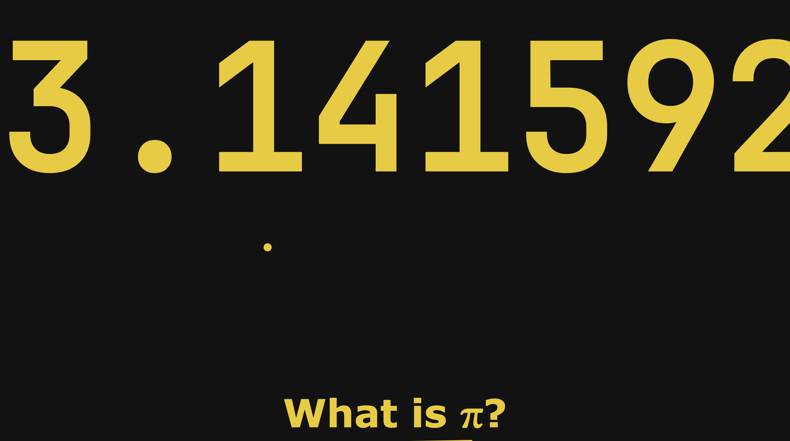

# Pi Site

A site about the number π, made by @Pi.

This page is under 10KB. (about 8KB, actually)

***Screenshot of the page, live on [tiny-pi-site.netlify.app](https://tiny-pi-site.netlify.app/)***

You may have already guessed by my name, but I love the number π. After being challenged to make a site as small as possible, I choose to make something recognizing my love for π. 

Choosing to make a site dedicated to π was, in part, because I would not require media assets or photos and the topic could be represented in a handful of digits. 

The one piece of media is an iframe into a custom, interactive Desmos graph I made specifically for this site in order to show the "Archimedes' Polygon Approximation" for π. This, of course, took up almost zero space, because it's just a single html tag. 

### About this project

As stated previously, this is the result of a challenge to make a site in as small a space as possible. That meant no custom fonts, no media, etc. 
Instead, I created spacers and a title from the digits themselves and some css. 

As you can see from the repo, this project is split into two parts. The first is the original source code. I wrote this in pure HTML and CSS (with a few lines of JS) in order to not have code from frameworks taking up my space budget.

After I finished the source code (which is about 10KB, give or take) I started minifying. I copied it from `src/` into `minified_src/` to save my progress and started out by reducing by hand. 

See, automatic tools are great for removing whitespace, newlines, unnecessary lines., etc. But it isn't able to intelligently remove dead code, simplify css parameters, that kind of thing. 

So I manually went through and took out common CSS properties like `width: 100%` and applied them all at once in a single declaration block to save the repeat properties. I did a few other things similar to this. 

Finally, as the last step, I ran all three files (`index.html`, `style.css` and `script.js`) through an automatic minmizer to remove whitespace. 

All in all the `minified_scr/` folder is roughly 8KB and contains everything needed to view the page. Just downloading it and double clicking `index.html` should open it correctly. When zipped, it gets compressed down to 5KB. 